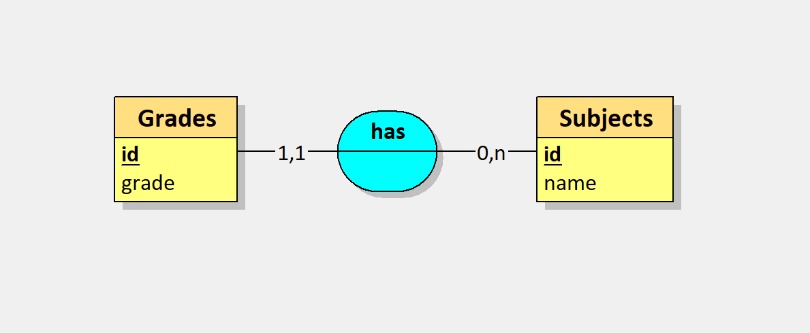
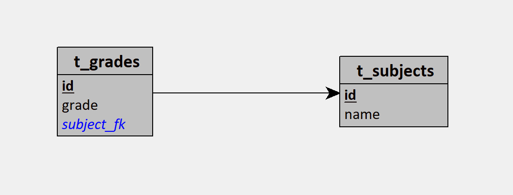

# SemaineVerte-DevChallenge
Une application Web a été abandonnée par des infras. C'est à vous de la finir pour avoir un bon suivi de vos notes. Pour se faire vous avez environs ~240min, le cours se déroulera dans les salles de cours. avant de commencer il faut fork le Repo pour avoir le code de base. les equipes se séparrons en groupe de 3 personne avec au moins une personne de 3ème année. 

Les étapes peuvent être complétées de la manière que vous voulez.

## Contexte
Le fichier server.js contient le cerveau du serveur. C'est là que vous modifierez, si nécessaire, les routes et les opérations sur la base de données. Une base de données SQLite est créée au lancement du serveur et contient, dans deux tables, les notes et les modules. Ces deux tables sont liées.

Un fichier index.html contient la page principale qui affiche les notes, leurs modules et un menu pour ajouter des notes et des modules. Le fichier style.css contient les styles et le fichier app.js le JavaScript de l'application.

Le dossier indice contient des indices pour les étapes 1 à 3 qui peuvent être utiles en cas de blocage.

### MCD


### MLD


## Technologies autorisées
- Un éditeur de code
- Internet et les documentations JavaScript et Express
- Aucun outil d'IA autorisé

---
## Installation
Avoir Node.JS de préférence 24

Cloner le dépot
```sh
git clone https://github.com/SemaineVerte-Grp2D/SemaineVerte-DevChallenge.git

cd SemaineVerte-DevChallenge
```

Installer les dépendances
```sh
npm install
```

Lancer le serveur
```sh
node server.js
```

---
## Challenges

### Challenge 1 — Organisation
Séparer les notes par module.

Indice : Voir `indice-1.md`

### Challenge 2 — Moyenne
Implémenter une moyenne par module avec pondération.

Indice : Voir `indice-2.md`

### Challenge 3 — Moyenne 2
Implémenter la moyenne semestrielle et la moyenne annuelle.

Indice : Voir `indice-3.md` 

---
## Pour aller plus loin

### Challenge 4 — Projets
Ajouter les résultats de projets

### Challenge 5 — Statistiques
Implémenter des statistiques sur les notes de projets.

### Challenge 6 — Exportation / Importation
Implémenter l'exportation et l'importation de notes et projets.

### Challenge 7 — Organisation 2
Séparer les notes générales (anglais, maths, etc) des notes de module.
