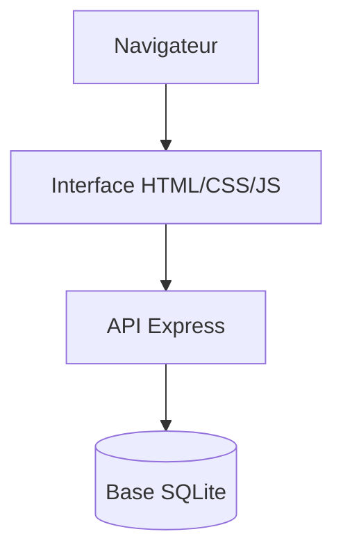

<div align="center">

# 🌱 SemaineVerte – DevChallenge

### Application Web de suivi des notes et modules


</div>

## 📖 Présentation

**SemaineVerte – DevChallenge** est une application Web pédagogique permettant de gérer des modules et leurs notes, puis de calculer différentes moyennes.

Le projet prend la forme d'un challenge de développement en équipe. Une application de départ doit être comprise, complétée et améliorée dans un temps limité. Le serveur repose sur Node.js, Express et SQLite, tandis que l'interface utilise HTML, CSS et JavaScript.

## 🎯 Objectifs du challenge

- comprendre rapidement une base de code existante ;
- organiser les notes par module ;
- calculer des moyennes pondérées ;
- calculer des moyennes semestrielles et annuelles ;
- manipuler une base de données relationnelle ;
- compléter des routes serveur ;
- connecter une interface Web à une API ;
- collaborer efficacement en équipe.

## ✨ Fonctionnalités principales

- gestion des modules ;
- ajout et consultation de notes ;
- association des notes à leur module ;
- stockage des données dans SQLite ;
- interface Web servie par Express ;
- calculs de moyennes ;
- organisation du projet autour d'un serveur et de ressources publiques ;
- indices progressifs pour accompagner les premières étapes.

## 🧩 Challenges

### Challenge 1 — Organisation

Séparer et afficher les notes par module.

### Challenge 2 — Moyenne pondérée

Calculer la moyenne d'un module en tenant compte de la pondération des notes.

### Challenge 3 — Moyennes générales

Calculer les moyennes semestrielles et annuelles.

### Pour aller plus loin

- gérer les résultats de projets ;
- produire des statistiques ;
- importer et exporter les notes ;
- distinguer les notes générales des notes de modules ;
- améliorer l'ergonomie et la validation.

## 🛠️ Technologies

- **Node.js**
- **Express 5**
- **SQLite**
- **JavaScript**
- **HTML5**
- **CSS3**
- package `cors` pour la gestion des requêtes

## 🗂️ Structure du dépôt

```text
SemaineVerte-DevChallenge/
├── DevChallenge/
│   ├── Indices/
│   ├── public/
│   │   ├── index.html
│   │   ├── styles
│   │   └── scripts
│   ├── server.js
│   ├── package.json
│   └── README.md
├── src/
│   └── archive du projet de départ
└── README.md
```

Le fichier `server.js` contient la logique du serveur, les routes et les opérations sur la base de données. Le dossier `public` contient l'interface accessible depuis le navigateur.

## ✅ Prérequis

- Node.js, de préférence une version récente compatible avec les dépendances ;
- npm ;
- Git ;
- un navigateur Web moderne.

## 🚀 Installation

1. Clone le dépôt :

   ```bash
   git clone https://github.com/Pt74bsx/SemaineVerte-DevChallenge.git
   cd SemaineVerte-DevChallenge/DevChallenge
   ```

2. Installe les dépendances :

   ```bash
   npm install
   ```

3. Lance le serveur :

   ```bash
   node server.js
   ```

4. Ouvre dans ton navigateur l'adresse indiquée par le serveur.

Une base SQLite est créée ou ouverte au démarrage. Elle contient des tables liées pour les modules et les notes.

## 🗃️ Modèle de données

L'application s'appuie sur deux entités principales :

- **Module** : représente une matière ou un module de formation ;
- **Note** : contient un résultat et sa pondération, associé à un module.

Cette relation permet d'afficher les notes par module et d'effectuer les calculs de moyennes.

## 🔌 Architecture générale



- l'interface envoie des requêtes au serveur ;
- Express valide et traite les actions ;
- SQLite conserve les modules et les notes ;
- les résultats sont renvoyés à l'interface.

## 🧪 Vérifications recommandées

- ajout d'un module ;
- ajout de plusieurs notes ;
- affichage séparé par module ;
- calcul avec différentes pondérations ;
- cas d'un module sans note ;
- valeurs invalides ou champs vides ;
- suppression ou modification d'une donnée ;
- redémarrage du serveur avec conservation des données.

## 🧠 Compétences travaillées

- JavaScript côté client et serveur ;
- API et routes HTTP ;
- SQL et relations entre tables ;
- calculs métier ;
- débogage d'une application existante ;
- lecture de documentation ;
- Git et collaboration ;
- organisation du travail sous contrainte de temps.

## ⚠️ Limites actuelles

- projet de challenge, potentiellement incomplet ;
- absence de suite de tests automatisés ;
- script npm de test non configuré ;
- validation et gestion des erreurs à renforcer ;
- authentification non prévue ;
- application destinée à un environnement pédagogique.

## 🔭 Améliorations possibles

- ajouter des tests unitaires et d'intégration ;
- créer un script `npm start` ;
- valider toutes les entrées côté serveur ;
- ajouter la modification et la suppression ;
- créer des graphiques de progression ;
- exporter les résultats en CSV ou JSON ;
- améliorer l'accessibilité ;
- sécuriser l'API si l'application est déployée.

## 👥 Origine et contexte

Le projet provient d'un challenge collectif de la Semaine Verte. Le fichier `package.json` référence le dépôt d'équipe `SemaineVerte-Grp2D/SemaineVerte-DevChallenge`.

## 📄 Licence

Le paquet Node.js déclare actuellement une licence ISC. Aucun fichier de licence global supplémentaire n'est ajouté ici afin de préserver correctement les droits du projet de départ et de ses contributeurs.

---

<div align="center">
Travail pédagogique et collaboratif.
</div>
